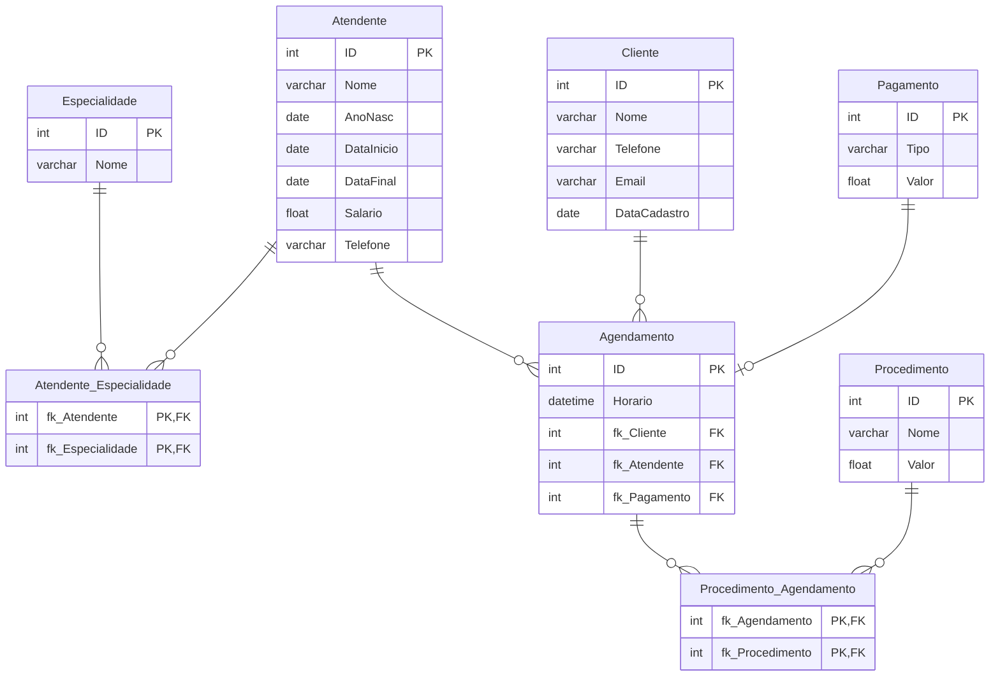

# ProjetoBancoDeDados

## Fase 1: Justificativa/Embasamento

1. O que é o negócio?

O setor de salões de beleza e estética é composto por empresas e profissionais que oferecem serviços e comercializam produtos relacionados aos cuidados com a aparência, saúde e bem-estar. Entre os principais serviços estão cortes de cabelo, manicure, pedicure, maquiagem, tratamentos estéticos, depilação, entre outros procedimentos voltados à estética pessoal.

2. Em que mercado ele está?

Ele se encontra no mercado de Beleza e bem-estar, de acordo com a pesquisa [Setor da beleza abre mais de 235 mil novos negócios e impulsiona empreendedorismo](https://g1.globo.com/jornal-nacional/noticia/2026/02/21/setor-da-beleza-abre-mais-de-235-mil-novos-negocios-e-impulsiona-empreendedorismo.ghtml), somente no ano de 2025 no Brasil foram registrados mais de 235 mil novos negócios nesse setor, demonstrando o crescimento da demanda e o fortalecimento do empreendedorismo na área.

3. Por que é relevante? 

Devido ao crescimento do setor de beleza e estética, torna-se essencial analisar os dados gerados pelo negócio para responder a perguntas importantes, como: **Quantos atendimentos foram realizados?**, **Em quais pontos o negócio está apresentando falhas?** e **Como é possível expandir a empresa de forma eficiente?**. Nesse contexto, a análise de dados desempenha um papel fundamental, permitindo que gestores tomem decisões mais estratégicas e fundamentadas. Para isso, é indispensável a utilização de um banco de dados estruturado, capaz de armazenar, organizar e disponibilizar as informações de forma segura e eficiente.

## Fase 2: Modelagem Conceitual do banco de dados (UML)

- Entregável: Diagrama Entidade-Relacionamento (DER), chaves primárias, chaves estrangeiras, relacionamentos, atributos mais relevantes.

